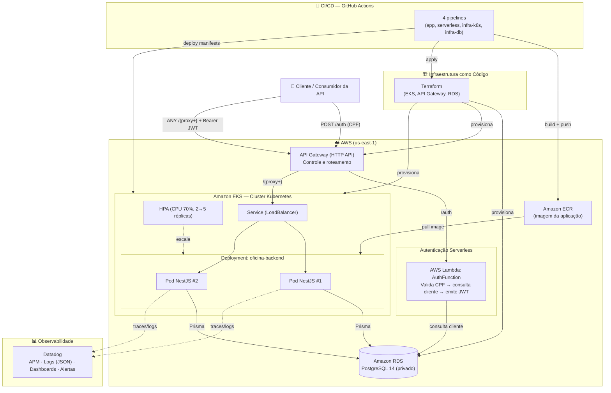

# Documentação de Arquitetura — Diagrama de Componentes

**Projeto:** Sistema de Gestão de Oficina Mecânica — Tech Challenge FIAP (Fase 3)
**Nuvem:** AWS · **Região:** us-east-1

## 1. Visão geral

A solução evolui o MVP das Fases 1 e 2 (API monolítica em NestJS) para uma **arquitetura corporativa em nuvem**, com segurança, escalabilidade, alta disponibilidade, automação de deploy e observabilidade. O sistema é dividido em **quatro repositórios** independentes, cada um com sua própria pipeline de CI/CD:

| Repositório | Responsabilidade | Tecnologia principal |
|---|---|---|
| `tech-challenge-fase3-app` | Aplicação principal (API de Ordens de Serviço) | NestJS + Prisma, Docker, K8s |
| `tech-challenge-fase3-serverless-auth` | Autenticação por CPF (Function Serverless) | AWS Lambda (Node.js) + SAM |
| `tech-challenge-fase3-infra-k8s` | Provisionamento do cluster e do API Gateway | Terraform (EKS, API Gateway) |
| `tech-challenge-fase3-infra-db` | Provisionamento do banco gerenciado | Terraform (RDS PostgreSQL) |

O **ponto de entrada único** é o **Amazon API Gateway**, que roteia:
- `POST /auth` → **Lambda de autenticação** (valida CPF, consulta o cliente no banco e emite o JWT);
- `ANY /{proxy+}` → **aplicação NestJS** rodando no **Amazon EKS** (rotas protegidas por JWT).

## 2. Diagrama de Componentes

## 3. Componentes e responsabilidades

### API Gateway (controle e roteamento)
Porta de entrada única da solução. Concentra o roteamento: encaminha a autenticação para a Lambda e todo o restante do tráfego para a aplicação no EKS. Isola a aplicação da internet (o único endpoint público é o Gateway).

### Function Serverless de Autenticação (AWS Lambda)
Responsável pela **autenticação por CPF**. Recebe o CPF, **valida os dígitos verificadores**, **consulta a existência e o status** do cliente na tabela `customers` do RDS e, se autorizado, **gera um JWT** (HS256) assinado com o **mesmo segredo** da aplicação. Roda **dentro da VPC** para alcançar o banco privado.

### Aplicação principal (NestJS no EKS)
API RESTful de Ordens de Serviço (clientes, veículos, serviços, estoque, OS, orçamentos), com arquitetura hexagonal. **Todas as rotas sensíveis são protegidas por JWT** (`JwtAuthGuard`). Empacotada em imagem Docker (multi-stage), publicada no ECR e executada em **Deployment com 2+ réplicas** e **HPA** para escalabilidade automática.

### Banco de Dados Gerenciado (Amazon RDS PostgreSQL)
Banco relacional gerenciado, **privado** (sem acesso pela internet), acessível apenas de dentro da VPC (EKS e Lambda). Escolha justificada na **RFC-002** e modelada em `03-modelo-dados.md`.

### Observabilidade (Datadog)
Instrumentação via `dd-trace` (APM) e logs estruturados em JSON (`pino`) com **correlação por `trace_id`**. Fornece **latência das APIs, consumo de CPU/memória, healthchecks, disponibilidade** e **dashboards de negócio** (volume diário de OS, tempo médio por status, falhas de integração). Ver **RFC-004** e **ADR-003**.

### CI/CD (GitHub Actions) e IaC (Terraform)
Cada repositório possui uma pipeline: a da aplicação faz build, testes, build/push da imagem no ECR e deploy no EKS; as de infraestrutura validam e aplicam o Terraform (com **state remoto no S3** — ver **ADR-004**). A `main` é protegida (merge só via Pull Request).

## 4. Fluxo de deploy (resumo)

1. Desenvolvedor abre **Pull Request** → `main` protegida.
2. Merge dispara a **pipeline** do repositório correspondente.
3. **App:** testes → build da imagem → push no **ECR** → `kubectl set image` / rollout no **EKS**.
4. **Serverless:** `sam build` → `sam deploy` (atualiza a Lambda).
5. **Infra:** `terraform init` (state no S3) → `plan` → `apply`.

> Diagramas de sequência detalhados em `02-diagramas-sequencia.md`.
