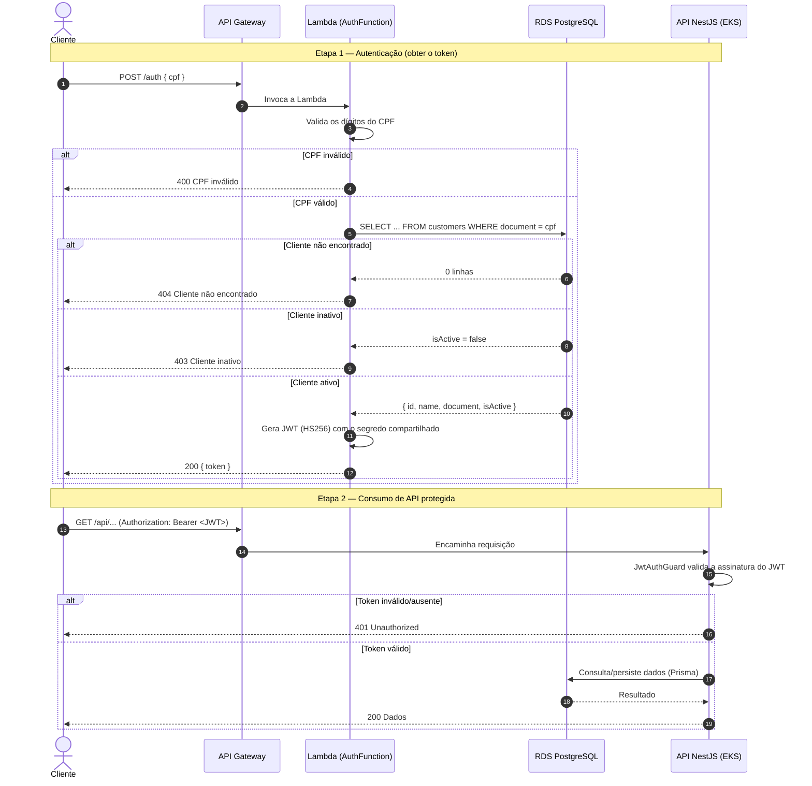
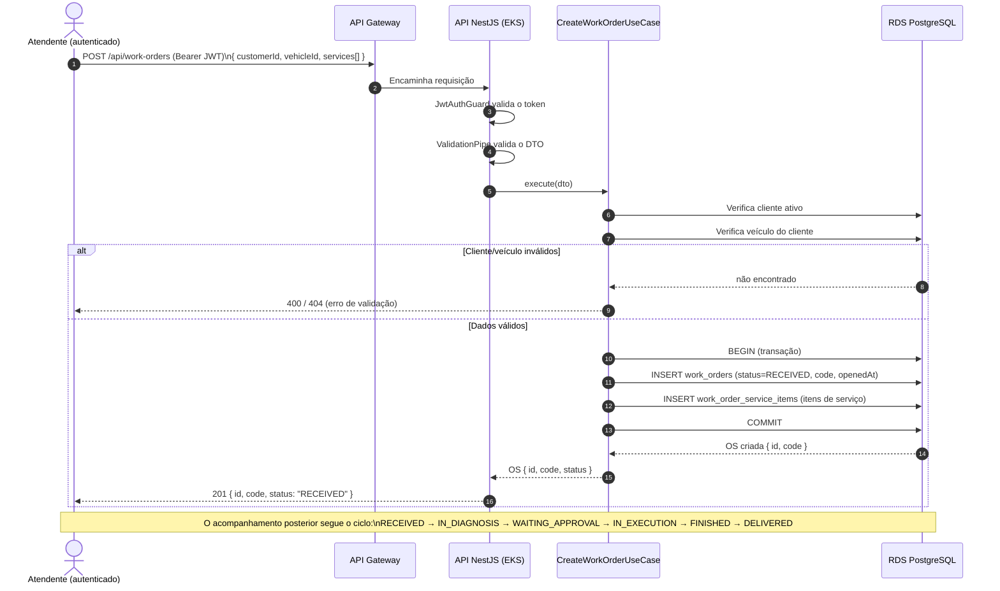

# Diagramas de Sequência

## 1. Fluxo de Autenticação por CPF

Este é o fluxo central da Fase 3. O cliente se autentica pelo **CPF**; uma **Function Serverless** valida o CPF, consulta o cliente no banco e emite um **JWT**; esse token é então usado para consumir as **APIs protegidas**.

**Pontos-chave de segurança:**
- A Lambda assina o JWT com o **mesmo `JWT_SECRET`** da aplicação; por isso o `JwtAuthGuard` do NestJS aceita o token emitido pela função serverless.
- O RDS é **privado**: tanto a Lambda quanto os pods do EKS o acessam apenas de dentro da VPC.
- O API Gateway é o **único ponto exposto** à internet.

## 2. Fluxo de Abertura de Ordem de Serviço (OS)

Fluxo de negócio principal: um atendente autenticado abre uma OS informando cliente, veículo e serviços. A API valida os dados, persiste a OS e seus itens e retorna a identificação única.

**Observações:**
- A OS nasce no status `RECEIVED` e evolui pelos status do domínio; as transições registram os carimbos de tempo (`diagnosisStartedAt`, `executionStartedAt`, `finishedAt`, `deliveredAt`) usados nas métricas de **tempo médio por etapa** (dashboards de observabilidade).
- O orçamento (`Budget`) é gerado a partir dos itens de serviço/peças e enviado ao cliente para aprovação, conforme o fluxo das Fases 1 e 2.
