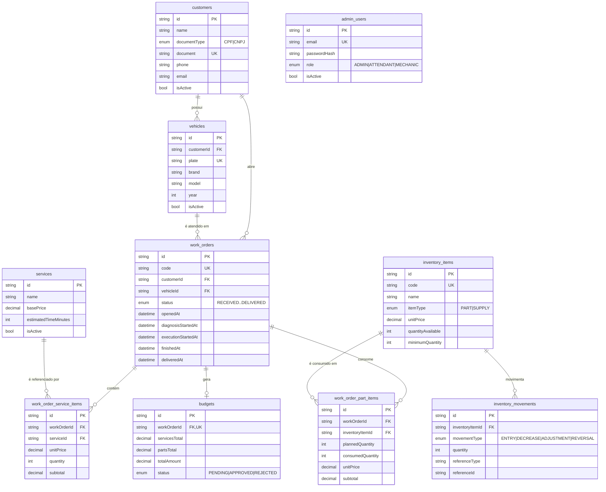

# Modelo de Dados — Diagrama ER, Relacionamentos e Justificativa

> A **justificativa formal da escolha do banco** (por que PostgreSQL) está na **RFC-002**. Este documento apresenta o **modelo relacional**, o **diagrama entidade-relacionamento**, os **relacionamentos** e os **ajustes de consistência e performance**.

## 1. Diagrama Entidade-Relacionamento (ER)

## 2. Entidades e relacionamentos

| Entidade | Descrição | Relacionamentos |
|---|---|---|
| **customers** | Clientes (PF/PJ) identificados por CPF/CNPJ | 1:N com `vehicles` e `work_orders` |
| **vehicles** | Veículos do cliente | N:1 com `customers`; 1:N com `work_orders` |
| **services** | Catálogo de serviços (ex.: troca de óleo) | 1:N com `work_order_service_items` |
| **inventory_items** | Peças e insumos, com controle de estoque | 1:N com `work_order_part_items` e `inventory_movements` |
| **inventory_movements** | Histórico de movimentação de estoque | N:1 com `inventory_items` |
| **work_orders** | Ordem de Serviço (núcleo do domínio) | N:1 com `customers` e `vehicles`; 1:N com itens; 1:1 com `budgets` |
| **work_order_service_items** | Serviços incluídos na OS | N:1 com `work_orders` e `services` |
| **work_order_part_items** | Peças/insumos consumidos na OS | N:1 com `work_orders` e `inventory_items` |
| **budgets** | Orçamento da OS | 1:1 com `work_orders` |
| **admin_users** | Usuários administrativos (login e-mail/senha) | Independente |

**Ciclo de vida da OS (enum `WorkOrderStatus`):**
`RECEIVED` → `IN_DIAGNOSIS` → `WAITING_APPROVAL` → `IN_EXECUTION` → `FINISHED` → `DELIVERED`.

## 3. Ajustes de consistência

- **Integridade referencial** com chaves estrangeiras e políticas explícitas de exclusão:
  - `onDelete: Restrict` em relações que não podem perder o histórico (ex.: não se apaga um cliente com OS, nem um serviço referenciado).
  - `onDelete: Cascade` nos itens que pertencem à OS (`work_order_service_items`, `work_order_part_items`) — ao remover a OS, seus itens vão junto.
- **Exclusão lógica** (`isActive = false`) em clientes, veículos, serviços e itens de estoque, preservando o histórico em vez de apagar registros.
- **Unicidade** garantida por índices únicos de negócio: `customers.document`, `vehicles.plate`, `inventory_items.code`, `work_orders.code` e `budgets.workOrderId` (garante 1 orçamento por OS).
- **Tipos adequados**: valores monetários em `Decimal(10,2)` (evita erros de ponto flutuante); `enum` para status/tipos (garante domínio fechado e legível); `DateTime` para os marcos temporais da OS.
- **Transações**: operações compostas (abertura de OS com itens, geração de orçamento, baixa de estoque) são feitas dentro de transações ACID, garantindo atomicidade.

## 4. Ajustes de performance

Índices criados além das PKs/UKs, sobre as colunas mais usadas em filtros e ordenações:

| Tabela | Índices | Motivo |
|---|---|---|
| `customers` | `name` | busca de clientes por nome |
| `vehicles` | `customerId` | listar veículos de um cliente |
| `work_orders` | `customerId`, `vehicleId`, `status`, `openedAt` | listagem/ordenção de OS por status e data (fila da oficina) e filtros por cliente/veículo |
| `work_order_service_items` | `workOrderId`, `serviceId` | montar a OS e relatórios por serviço |
| `work_order_part_items` | `workOrderId`, `inventoryItemId` | consumo de peças por OS/item |
| `inventory_items` | `itemType`, `isActive` | consultas de estoque ativas por tipo |
| `inventory_movements` | `inventoryItemId`, `movementType`, `(referenceType, referenceId)` | histórico e rastreio de movimentação |
| `budgets` | `status` | filtrar orçamentos pendentes/aprovados |

Esses índices sustentam as consultas críticas do domínio — em especial a **listagem priorizada de OS** (por status e mais antigas primeiro) e o **cálculo do tempo médio por etapa**, usados nos dashboards de observabilidade.
